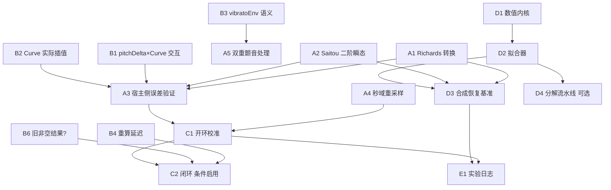

# 深度研究报告执行计划书

前置文档：[opus-feasibility-assessment.md](opus-feasibility-assessment.md)
研究来源：[source-research.md](source-research.md)
基线：SV Copilot v0.9.0，Node.js，42 operations / 7 facade tools
制定日期：2026-08-02

---

## 0. 计划原则

1. **不引入第二运行时。** 数值子系统在 JS 中自研（可行性报告 §5 Tier 3 论证）。
   与 `THIRD_PARTY_NOTICES.md` 的 clean-room 政策一致：AVA / VibratoScope / Saitou 论文
   作为**数学需求参考**，不复制代码或常量。
2. **不破坏既有硬契约。** 一次 commit 至多一个用户可见 Undo；`atomic:true` 是
   journal + 读回 + 补偿而非 ACID；感知判断永远 `human_only`；宿主布尔返回值不作后置条件。
3. **先做前向，后做逆向。** 前向生成确定、便宜、可离线测试；逆向拟合昂贵且需要前向
   作为合成真值来源。报告本身也强调这一顺序。
4. **每阶段的退出条件必须可机械判定。** 不接受"看起来更好听"作为退出条件。
5. **`capability-blocked` 项不进计划**（音频渲染、A/B 刺激材料自动化、机器听感、
   `project_revision`）。

---

## 阶段 A：前向技法模型（无新依赖，可立即开始）

目标：让 `sv_plan_pitch_gesture` 能表达 Saitou 的 overshoot / preparation 与
AVA 的非对称 logistic 转换，同时保持现有的确定性、点预算与信封契约。

### A1. Richards（广义 logistic）转换形状

**位置**：`server/src/pitch-gesture-plan.js`，新增 shape `"logistic"`
（现有 `PITCH_GESTURE_SHAPES = ["linear","smoothstep","cosine"]`）。

**参数化**（用报告的外部形式，不暴露 `A`/`M`）：

| 请求字段 | 单位 | 说明 |
| --- | --- | --- |
| `inflectionRatio` | ratio `[0,1]` | 拐点在技法时长内的相对位置，映射到 `t_R` |
| `sharpness` | 无量纲 | `G = sharpness / T`，使"同样的锐度"在 100 ms 与 500 ms 上表现一致 |
| `asymmetryLogB` | 无量纲 | `q = log B`；`0` 退化为普通 logistic |

**实现**：`P(t) = y₀ + (y₁-y₀)·exp(-logaddexp(0, log B - G(t-t_R)) / B)`。
JS 无 `numpy.logaddexp`，需自行实现稳定版本：
`logaddexp(a,b) = max(a,b) + log1p(exp(-|a-b|))`。

**必须保持的既有性质**：
- 端点严格命中 `y₀`/`y₁`（现有 attack/release 依赖此性质做边界连续）；
- `|value| ≤ depth`（现有"有界不超调"契约对 transition 类仍然适用）；
- 确定性：同一请求逐字节相同的 plan（`planId` 是内容哈希）。

**退出条件**：
- `asymmetryLogB=0, inflectionRatio=0.5` 时与解析 logistic 逐点一致（1e-12）；
- 单调性：任意合法参数下 `P(t)` 在区间内单调（属性测试，≥1000 随机组合）；
- 极端参数（`sharpness` 上下界、`|asymmetryLogB|` 上下界）无 NaN/Inf；
- 现有 `pitch-gesture-plan` 回归全绿，`plan-apply-schema.test.mjs` 通过。

### A2. Saitou 二阶瞬态（overshoot / preparation）

**位置**：同上，新增 gesture type `"transient"`（不复用 attack/release —— 它们的
"有界不超调"是刻意契约，超调必须是显式的新类型，否则会静默改变既有请求的行为）。

**外部参数化**（报告 §Mathematical Models 的建议，正确且应采纳）：

| 请求字段 | 单位 |
| --- | --- |
| `peakSemitone` | semitone（带符号，`s` 方向由符号承载） |
| `peakTimeSeconds` | s |
| `dampingRatio` | ratio `[0,1)` |
| `onsetSeconds` | s（相对音符起点） |

内部映射（报告已给出，已核对与 Saitou 原文一致）：
`ω_n = arccos(ζ) / (t_peak·√(1-ζ²))`，`k = A_peak·ω_n·e^{ζ·ω_n·t_peak}`。

**必须处理的四个阻尼分支**（报告的分支策略正确，应照做）：
`ζ < 1-tol` 用 `sin` 形式；`ζ > 1+tol` 用两个衰减指数之差（避免 `sinh` 溢出）；
`|ζ-1| ≤ tol` 用精确临界解 `k·τ·e^{-ω τ}`。**不要**在 `ζ≈1` 附近数值求 `√(1-ζ²)`。

**新增契约（这是超调类型的诚实性要求）**：
- `transient` 是**唯一**允许超出 `maxAbsDepthSemitone` 名义包络的类型，
  因此它必须有自己的独立上限 `maxAbsPeakSemitone`，并在响应中显式声明
  `overshoots: true`；
- 衰减尾部必须在音符边界前收敛到 `< 1 cent`，否则报 `CONSTRAINT_VIOLATION`
  （不静默截断 —— 截断会产生斜率不连续）。

**退出条件**：
- 三个阻尼分支各有解析闭式对照测试；`ζ = 1±1e-6` 与 `ζ=1` 的输出连续（`< 1e-9`）；
- 从 `(A_peak, t_peak, ζ)` 生成的曲线，其实测首峰值/首峰时刻回归到输入（`< 0.1%`）；
- Saitou 原文参数（`Ω=0.0348 rad/ms → 34.8 rad/s`, `ζ=0.5422`）能被表达，
  且作为一个命名 preset 存在（不是硬编码常量：从 `(A_peak,t_peak,ζ)` 反推得到）。

### A3. 编译误差的宿主侧验证（报告遗漏的现成句柄）

**问题**：现有 `bake-computed-pitch.js` 的 RDP 只保证**线性重建**误差 ≤ tolerance。
`Automation` 的插值可能是 `Cosine` 或 `Cubic`（`getInterpolationMethod` 只能读、
不能设，见可行性报告 §3.2），`PitchControlCurve` 的插值行为官方未文档化。

**方案**（比报告的"等 computed pitch"便宜一个数量级）：

- `PitchControlCurve` → 写入后用 `getValueAt(相对 anchor 的 blick)` 在密集网格上采样，
  与密集目标曲线比较，得到**真实**最大 cents 误差；
- `pitchDelta` Automation → 用 `get(b)`（宿主实际插值）与 `getLinear(b)` 各采一遍：
  两者之差直接量化"我们的线性假设错了多少"。

**新增只读 operation**：`read` 分组下 `verify_curve_fidelity`
（或作为 `sv_patch_pitch_controls` / `sv_patch_parameter_curves` 提交后的可选
`verifyFidelity: true` 段落 —— 后者更省调用，推荐）。

**退出条件**：
- 假宿主对三种插值模式各有回归；
- 报告的 `Mh²/8` 曲率自适应预选 + vertical RDP 组合后，`Cubic` 模式下的实测误差
  也在 tolerance 内，否则递归加点（报告的编译流程最后一步，应实现）；
- 误差超限时**不静默通过**：上报 `warnings: [{code:"COMPRESSION_ERROR_EXCEEDED"}]`
  并给出实测值。

### A4. 测量网格的秒域重采样

**问题**（可行性报告 §3.5）：`getComputedPitchForGroup` 只能等 BLICK 采样；
有 tempo 变化时这不是等秒采样，会使 Hz 域估计（颤音速率、`ω_n`）系统性偏移。

**方案**：`computed-pitch-compare.js` 在做任何 Hz 域分析前，把帧的绝对 BLICK 经
`secondsAtBlick` 映射到秒，检测秒间隔的变异系数；超过阈值则先在秒域重采样到均匀网格，
并在 `provenance` 中声明 `timeGrid: "resampled_to_uniform_seconds"`。

**退出条件**：
- 含 tempo 变化的合成 fixture 上，颤音速率估计误差从（当前）系统性偏移降到 `< 2%`；
- 无 tempo 变化时输出与当前实现逐值一致（不引入回归）；
- tempo map 缺失时报 `not_captured`，不假设恒定 tempo。

### A5. `vibratoEnv` 双重颤音风险的处理（阻塞任何颤音发布）

**问题**（可行性报告 §3.6）：SV2 自己生成颤音（`Automation` 的 `vibratoEnv`，范围 0–2，
默认 1；`Note.getAttributes` 的 `dF0VbrMod`）。当前 `sv_plan_pitch_gesture` 的 vibrato
写密集正弦，与宿主颤音**叠加**。

**A5a（只读调查，Phase 0 真机）**：用一个长音符，分别在
`vibratoEnv ∈ {0, 1, 2}` × `写入正弦 / 不写` 的 6 个组合下读 computed pitch，
确认叠加关系。写入 host profile（`tools/lib/host-behavior-profile.mjs`）。

**A5b（依据证据实现）**：
- 若确认叠加 → `sv_plan_pitch_gesture` 的 vibrato **必须**要求调用方显式选择
  `vibratoSource: "host_envelope" | "explicit_curve"`：
  - `host_envelope`：只写 `vibratoEnv` 自动化点（几个点，极省），不写正弦；
  - `explicit_curve`：写正弦，**并**在同一事务中把区间内 `vibratoEnv` 压到 0。
    这是跨数据面写入（Automation + PitchControl），必须走统一 journal / 一个 Undo /
    双面读回。若本版无法保证，则**显式拒绝**（沿用 `PITCH_DELTA_CLEAR_UNSUPPORTED`
    的诚实模式），不静默产出双重颤音。
- 在证据到手前，现有 vibrato 的工具描述必须加上"宿主原生颤音未被抑制"的警告。

**退出条件**：host profile 中该语义标记为 `confirmed`；两种 source 各有回归；
`explicit_curve` 的跨数据面事务有故障注入回归（Automation 写成功、PitchControl 写失败
必须双面回滚）。

---

## 阶段 B：Phase 0 真机证据（阻塞阶段 C）

全部为**可恢复写**实验，需人工驱动的 SynthV。产出写入 host profile，
不写入仓库 fixture（沿用 [Host Profile 工作流](../../../operations/host-profiles.md)）。

| 编号 | 实验 | 阻塞什么 |
| --- | --- | --- |
| B1 | `pitchDelta` × `PitchControlCurve` 交互：curve 覆盖区间内 pitchDelta 是否仍叠加？ | 两个 application mode 能否共存（可行性 §3.7） |
| B2 | `PitchControlCurve` 实际插值：用 `getValueAt` 密集采样反推是线性/余弦/三次 | A3 的误差界 |
| B3 | `vibratoEnv` 叠加语义（= A5a） | 所有颤音发布 |
| B4 | computed pitch 在写入后的重算延迟与稳定判据：`stablePolls` 现取几次足够？ | 闭环迭代的墙钟成本估计 |
| B5 | `PitchControlPoint` 与 `PitchControlCurve` 混存时的优先级 | 编译策略 |
| B6 | 写入后 `getComputedPitchForGroup` 是否曾返回**旧的非空**结果（而非空数组） | 闭环的正确性 —— 若会，则必须用内容哈希而非"非空"作为就绪判据（现有实现已用 `contentHash`，此实验是确认它必要） |

**退出条件**：每项在 host profile 中为 `confirmed` 或 `unconfirmed`（明确标注），
不允许 `simulator_default` 冒充真机证据。

---

## 阶段 C：开环校准（推荐路径）与闭环的条件启用

可行性报告 §6 的决策点：闭环必须写入活工程（无法在离体克隆上测 computed pitch），
每轮一个 Undo。**本计划推荐先做开环 (d)**。

### C1. 开环校准：`sv_plan_pitch_correction`

**定位**：`plan` 分组，只读，纯内存。输入两个已存 context（目标曲线 artifact + 实测
computed pitch context），输出一个**修正补丁 plan**，走既有 `apply` 信封交给
`sv_patch_pitch_controls` 或 `sv_patch_parameter_curves`。

**数学**（报告的正则化更新，`J_k = I`）：

```
Δu = argmin ‖W^{1/2}(Δu - e)‖² + λ‖D₂(u+Δu)‖² + μ‖Δu‖²
```

法方程 `(W + λD₂ᵀD₂ + μI)Δu = We - λD₂ᵀD₂u`。系数矩阵是**五对角对称正定**
（`D₂ᵀD₂` 是带宽 2 的带状矩阵），因此**不需要通用稀疏求解器**：
带状 Cholesky（或 Thomas 算法的带状推广）即可，`O(n)`，几十行 JS。
这是可行性报告"JS 自研可行"结论的关键依据。

**契约**：
- 纯只读、不进 `ExecutionCoordinator`、不写宿主（与现有 planner 一致）；
- `W` 由 computed pitch 的 `null` 掩码给出：`null` 帧权重 0，绝不当作零误差
  （沿用现有"全 null 是不足以分析，不是零误差"的规则）；
- 覆盖率低于 `lowCoverageWarnRatio` 时拒绝出计划，而不是出一个基于稀疏样本的计划；
- 输出必须声明 `iterationBasis: "single_open_loop_step"` 与
  `expectedUserUndoSteps: 1` —— 模型自己决定是否再来一轮，每轮都是一次正常的
  plan → dry-run → commit → verify。

**退出条件**：
- 合成场景（已知宿主响应 = 恒等 + 已知偏移）上，一步开环把加权 RMSE 降低 ≥ 80%；
- 带状求解器与稠密参考解一致（`< 1e-10`，`n` 至 2000）；
- `λ`/`μ` 极端值下解不振荡（属性测试）；
- 目标曲线的强制锚点（技法起点、峰值、拐点、颤音淡入淡出边界、音符边界）在修正后
  仍被保留（报告的 mandatory anchors 要求，防止正则化把技法磨平）。

### C2. 闭环（条件启用，需 B4 + 用户对 Undo 语义的决策）

只有在同时满足以下条件时才实现：

1. B4 给出每轮墙钟成本，且 `K ≤ 5` 时总耗时可接受；
2. 用户明确选择了 Undo 语义（每轮一个 / 恢复重写 / scratch track）；
3. C1 的开环单步已验证收敛方向正确。

**必须实现的诚实性**（报告的停止条件表可直接采纳，但需补 Undo 与中间态）：
- `expectedUserUndoSteps` 上报真实的 K 或 2K，不四舍五入为 1；
- 迭代 k 成功、k+1 失败 → `status: "partial"`，并给出"当前处于第 k 轮结果"的
  明确 `data.state`，不谎称 `rolled_back`；
- 报告的 backtracking（`E_{k+1} > E_k` 则恢复并 `α/2`）与增长上限
  （`α ← min(1, 1.2α)`）照实现；
- 误差反号且振幅增长 → 立即停止并报 `FEEDBACK_OSCILLATION`。

---

## 阶段 D：逆向拟合（最大新子系统）

### D1. 数值内核

在 JS 中实现带边界约束的非线性最小二乘 + 鲁棒损失。范围可比报告显著收缩，
因为唯一输入是 computed pitch 而非提取 F0（可行性报告 §3.4）：
不需要 MAD 离群过滤、不需要音高跟踪器容错、Huber 尺度可从 `null` 掩码与
量化噪声直接给出而非"5–15 cents 工程先验"。

**实现**：Levenberg-Marquardt + 参数变量变换处理边界
（报告已在代码里用了这个技巧：优化 `log G`、`log B` 保证正性 —— 应采纳），
Huber 通过 IRLS 权重迭代实现。多起点用报告的确定性网格
（γ∈{3,6,10,16} × B∈{0.35,0.6,1,1.7,3}；`ζ∈{0.15,0.3,0.5,0.7,0.95,1.2}`）。

**退出条件**：与解析可解的病态最小二乘问题对照；边界处不越界；确定性
（同输入同输出，逐位）。

### D2. 拟合器

按报告的分级顺序：logistic 转换拟合 → 二阶瞬态拟合 → 颤音参数估计
（后者复用 `computed-pitch-compare.js` 已有的 detrended autocorrelation 作为初值）。

**必须实现报告的拒绝判据表**（这是防止"拟合出一个数字就当成技法"的关键）：
端点不匹配、拐点逃逸、过陡（有效转换短于采样分辨率）、退化区间、
鲁棒拟合不优于直线/PCHIP 基线、边界冲突、多起点解不稳定（成本相近但参数迥异）。
任一命中 → 标记为 `insufficient_evidence`，不返回参数。

### D3. 合成参数恢复基准

报告的四个族（孤立 logistic / 孤立二阶 / 混合 / 对抗）应实现，
但"对抗"族要按本项目实际改写：不是"缺失 F0、离群点"，而是
**`null` 帧、tempo 变化导致的非均匀秒网格、短音符、采样过粗**。

**退出条件**（关键：报告正确指出曲线 RMSE 不够）：
- 参数恢复误差在预注册容差内，**且**曲线 RMSE 达标 —— 两者都必须报告；
- ≥1000 个随机但有界的样本，每个存种子、真参数、密集真值、观测、拟合参数、
  重建曲线、优化器诊断、软件版本（报告的可复现要求，与本项目 artifact 哈希纪律一致）。

### D4. 分解流水线（可选，依赖 D2）

报告的分级分解顺序（先拟合乐句基线 → 检测并压平颤音 → 分段 → logistic → 瞬态 →
联合精化，联合项带向分级解的正则化）是正确的方法论，可采纳。

**AVA 的 HMM portamento 检测器**列为**低优先级**：本项目有乐谱
（音符边界已知），报告自己也承认"score-informed candidate windows"是分段的替代方案，
在有乐谱时它严格更好。移植 MATLAB HMM 的性价比低。

---

## 阶段 E：可复现性与人类试听

### E1. 实验日志

报告的 JSON Lines schema 可直接采纳，但必须落在既有 `artifact-store.js`
（不可变、内容哈希、租期、配额），而不是新建日志子系统。

### E2. 人类试听

**降级为**：MCP 只提供不可篡改的试次日志（`record_preference_trial` 等价物）
+ 既有 `sv_audition_compare` 的播放编排。刺激材料的导出与一致性由人保证
（无 render API，可行性报告 §3.8）。

**不实现**：混合效应 logistic 模型、功效分析、被试招募层 —— 这些是研究方法工作，
不是 MCP 服务器的职责。若需要，导出日志到外部统计工具。

---

## 依赖关系



关键路径：`B3 → A5`（阻塞任何颤音发布）与 `B1/B2 → A3 → C1`（阻塞校准）。
`D` 系列与 `A/C` 并行，只在 `D3` 处汇合（需要 `A1`/`A2` 提供合成真值）。

---

## 横向发布要求（沿用主计划 §8，逐项适用于本计划）

每个新增能力必须同时满足：

- **契约**：完整 MCP input schema，所有对象 `additionalProperties:false`；
  在 `operation-catalog.js` 登记 facade 路由（未登记则服务器启动即失败）；
  在 `surface-io-policy.js` 登记传输形状与预算；
  root 字段在 `root-envelope.js` 登记；status 在 `result-status.js` 的冻结矩阵内。
- **单位纪律**：所有数值字段带单位后缀（`Semitone` / `Cent` / `Hz` / `Seconds` /
  `Blick` / `Quarter`）。**绝不**出现无后缀的 `depth` / `time` / `amount`。
  semitone 与 cent 不得在同一字段族混用。
- **诚实性**：`human_only` 的判断不得被表述为观测事实；启发式阈值必须标注
  `engineering_heuristic_requires_host_calibration`；`null` 帧不进数值统计。
- **测试**：新 `*.test.mjs` 必须加入 `server/package.json` 的 `scripts.test`
  显式文件列表（不是 glob）。写面必须有逐边界故障注入回归。
- **文档**：`workflow-guide.js` 的示例请求会被 `workflow-guide.test.mjs` 用真实
  served schema 校验，新增 recipe 必须 schema-valid。

---

## 明确不进入本计划

| 项 | 决策 |
| --- | --- |
| Python 侧车 / scipy 依赖 | `not-planned`：JS 自研（带状 Cholesky + LM + IRLS 足够，见 C1/D1） |
| 从任意录音自动发现技法 | `capability-blocked`：无音频输入面 |
| 程序化产出 A/B 刺激音频 | `capability-blocked`：`setBounced()` 只改标记，不渲染 |
| 机器听感评分 | `capability-blocked`：沿用主计划既有决策 |
| `project_revision` 身份字段 | `not-planned`：官方无此 API；用既有 fingerprint + 读回 |
| 显式设置 Automation 插值模式 | `capability-blocked`：只有 `getInterpolationMethod` |
| AVA HMM portamento 检测器移植 | 低优先级：有乐谱时 score-informed 窗口严格更优 |
| Gaussian-process / 神经先验风格生成 | `not-planned`：报告自己列为"harder to audit"；与本项目可审计性目标冲突 |

---

## 起步建议

**第一批（无阻塞、无新依赖、独立可验证）**：A1 + A2 + A4。
三者都是纯前向计算，落在 `pitch-gesture-plan.js` 与 `computed-pitch-compare.js`，
有完整的离线回归路径，且立即填上可行性报告 §4 识别出的两个真实能力缺口
（无法表达超调、无非对称转换）。

**并行**：把 B1/B2/B3 写成一份 Phase 0 真机实验清单，等一次人工驱动的 SynthV 会话
一并采集 —— 它们共用同一个 fixture 工程，分开做是浪费。
