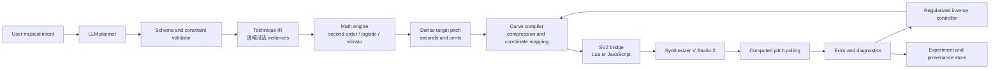
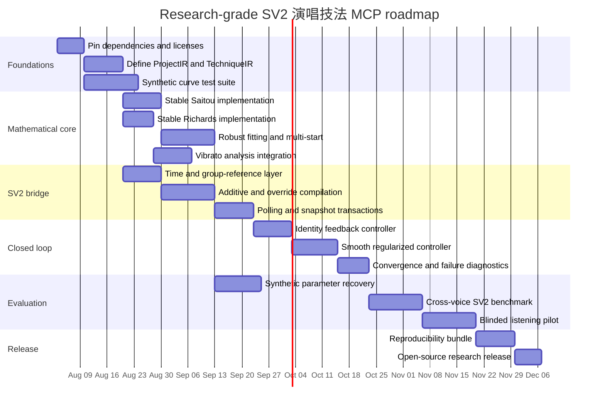

# Open-Source, Research-Grade MCP Pipeline for LLM-Driven SV2 Pitch Tuning with Interpretable 演唱技法 Models

## Executive Summary

A research-grade pipeline for LLM-driven control of Synthesizer V Studio 2 is technically feasible with current SV2 scripting APIs and existing open-source work. The strongest architecture is not “LLM writes pitch points,” but:

\[
\text{LLM intent}
\rightarrow
\text{validated 演唱技法 plan}
\rightarrow
\text{continuous target pitch}
\rightarrow
\text{SV2 control compilation}
\rightarrow
\text{computed-pitch measurement}
\rightarrow
\text{feedback correction}
\]

The term **演唱技法** should denote interpretable musical techniques—such as vibrato, portamento, しゃくり, overshoot, and preparation—not arbitrary control-point patterns. A technique should be represented by semantically meaningful parameters such as depth in cents, duration in milliseconds, inflection position, damping, rate, phase, and envelope.

The recommended mathematical core combines two models:

| Model | Best use | Main parameters | Principal advantage | Principal limitation |
|---|---|---|---|---|
| Saitou second-order dynamical model | Overshoot, preparation, decaying pitch transients; historically also vibrato | Natural frequency, damping ratio, gain, onset | Compact physical interpretation; generates rebound naturally | Parameters are correlated and difficult to identify in mixtures |
| AVA generalized logistic model | Portamento, しゃくり, monotonic note transitions | Endpoints, steepness, inflection time, asymmetry | Handles asymmetric transitions; easy to constrain | The published \(A\) and \(M\) parameters are algebraically non-identifiable without reparameterization |
| Explicit time-varying sinusoid | Practical vibrato generation | Rate, depth, phase, onset, fade, drift | More intuitive than raw second-order parameters | Less unified with Saitou’s original dynamical formulation |
| Spline or PCHIP | Residual phrase trends and manual anchors | Knot positions and values | Flexible and numerically predictable | Less interpretable as an 演唱技法 |
| Gaussian-process or neural prior | Later context-conditioned style generation | Learned | Can model variability and context | Harder to audit, reproduce, and control |

Saitou and colleagues modeled singing pitch as a score-level melody plus overshoot, preparation, vibrato, and fine fluctuation, using a second-order transfer function for the first three components. AVA detects and removes vibrato before portamento analysis, uses a three-state HMM to locate transition regions, and fits those regions with a six-parameter generalized logistic curve. These two lines of work are therefore complementary rather than competing. citeturn2view4turn4view0turn5view0turn5view1turn5view2

The principal engineering findings are:

| Finding | Consequence for implementation |
|---|---|
| Work internally in physical seconds and logarithmic pitch units | Vibrato rate remains measured in hertz across tempo changes, and cents remain additive |
| Reparameterize AVA’s logistic equation | Fit \((t_R,G,B)\), not simultaneously free \(A\) and \(M\) |
| Separate generation from fitting | Forward generation is straightforward; inverse identification requires staged decomposition and multi-start robust fitting |
| Treat `pitchDelta` and `PitchControlCurve` as different compilation targets | `pitchDelta` adds relative automation; `PitchControlCurve` overrides generated pitch in its region |
| Bind all measurement to a specific `NoteGroupReference` | The same `NoteGroup` may produce different computed pitch through different references |
| Poll computed pitch asynchronously | SV2 can return an empty array while pitch computation is incomplete |
| Use snapshots as well as undo records | The documented API groups edits into undo records, but a programmatic “undo now” operation is not documented |
| Compress only after generating a dense mathematical curve | Simplification should have a measurable maximum error in cents |
| Validate the actual SV2 result, not merely the written control data | Internal pitch generation, interpolation, voice database behavior, and existing controls may alter the final trajectory |

SV2’s official scripting documentation exposes project time-axis conversion, `pitchDelta` automation, pitch control points and curves, asynchronous callbacks, project undo records, and `SV.getComputedPitchForGroup()`. The computed-pitch method returns floating MIDI pitch values, uses `null` where pitch is unavailable, may return an empty array while computation is unfinished, and is explicitly tied to a `NoteGroupReference`. citeturn7view0turn8view2turn3view3turn3view4turn7view1turn8view3turn9view0turn8view1turn7view3turn7view4

The recommended first release should support forward generation, SV2 compilation, computed-pitch polling, regularized feedback correction, reproducible logging, and synthetic parameter-recovery tests. Automatic discovery of techniques in arbitrary commercial recordings should be treated as a later research track.



## Mathematical Models and Reference Implementations

All mathematical components should use **seconds** for time and **cents** or floating semitones for pitch. Given a frequency \(F_0(t)\) and reference frequency \(F_{\mathrm{ref}}\),

\[
x(t)
=
1200\log_2\frac{F_0(t)}{F_{\mathrm{ref}}}.
\]

For a MIDI-note baseline \(m(t)\), the relative pitch deviation is

\[
d(t)
=
1200\log_2\frac{F_0(t)}
{440\cdot 2^{(m(t)-69)/12}}.
\]

This logarithmic coordinate makes pitch offsets additive:

\[
x_{\mathrm{total}}(t)
=
x_{\mathrm{score}}(t)
+
x_{\mathrm{phrase}}(t)
+
\sum_j T_j(t;\theta_j)
+
r(t).
\]

Here, \(T_j\) is an interpretable 演唱技法 component and \(r(t)\) is an explicitly labeled residual rather than an unnamed “style” term.

**Saitou second-order model.** The transfer function used by Saitou and colleagues is

\[
H(s)
=
\frac{k}
{s^2+2\zeta\omega_n s+\omega_n^2},
\]

where \(\omega_n\) is the natural angular frequency, \(\zeta\) is the damping ratio, and \(k\) is the gain. The paper uses damped responses for overshoot and preparation, an undamped response for vibrato, and a separately filtered stochastic component for fine fluctuation. Its reported example parameters are expressed in radians per millisecond, so a direct implementation using seconds must multiply those angular frequencies by \(1000\). citeturn2view4turn4view0

For \(\tau=t-t_0\geq0\), the impulse response is:

\[
h(\tau)=
\begin{cases}
\displaystyle
\frac{k}{\omega_n\sqrt{1-\zeta^2}}
e^{-\zeta\omega_n\tau}
\sin\left(\omega_n\sqrt{1-\zeta^2}\tau\right),
&0\leq\zeta<1,\\[1.2em]
\displaystyle
k\tau e^{-\omega_n\tau},
&\zeta=1,\\[0.8em]
\displaystyle
\frac{k}{2\omega_n\sqrt{\zeta^2-1}}
\left[
e^{(-\zeta+\sqrt{\zeta^2-1})\omega_n\tau}
-
e^{(-\zeta-\sqrt{\zeta^2-1})\omega_n\tau}
\right],
&\zeta>1.
\end{cases}
\]

A stable vectorized implementation should branch around critical damping instead of evaluating \(\sqrt{1-\zeta^2}\) numerically near \(\zeta=1\).

```python
from __future__ import annotations

import numpy as np
from numpy.typing import ArrayLike, NDArray


FloatArray = NDArray[np.float64]


def second_order_impulse(
    time_s: ArrayLike,
    *,
    onset_s: float,
    omega_n_rad_s: float,
    damping_ratio: float,
    gain: float,
    critical_tolerance: float = 1e-5,
) -> FloatArray:
    """
    Evaluate the impulse response of
        H(s) = gain / (s^2 + 2*zeta*omega_n*s + omega_n^2)

    Parameters
    ----------
    time_s:
        Absolute sample times in seconds.
    onset_s:
        Technique onset in absolute seconds.
    omega_n_rad_s:
        Positive natural angular frequency in rad/s.
    damping_ratio:
        Non-negative damping ratio.
    gain:
        Gain in units consistent with the requested cents output.
    """
    t = np.asarray(time_s, dtype=np.float64)
    if omega_n_rad_s <= 0:
        raise ValueError("omega_n_rad_s must be positive")
    if damping_ratio < 0:
        raise ValueError("damping_ratio must be non-negative")

    tau = t - float(onset_s)
    active = tau >= 0.0
    u = np.maximum(tau, 0.0)
    zeta = float(damping_ratio)
    omega = float(omega_n_rad_s)

    result = np.zeros_like(u)

    if zeta < 1.0 - critical_tolerance:
        beta = np.sqrt(max(1.0 - zeta * zeta, np.finfo(float).eps))
        result = (
            gain
            / (omega * beta)
            * np.exp(-zeta * omega * u)
            * np.sin(omega * beta * u)
        )

    elif zeta > 1.0 + critical_tolerance:
        alpha = np.sqrt(zeta * zeta - 1.0)
        # Difference of two decaying exponentials avoids sinh overflow.
        slow = np.exp((-zeta + alpha) * omega * u)
        fast = np.exp((-zeta - alpha) * omega * u)
        result = gain / (2.0 * omega * alpha) * (slow - fast)

    else:
        # Exact critical-damping limit.
        result = gain * u * np.exp(-omega * u)

    result[~active] = 0.0
    if not np.all(np.isfinite(result)):
        raise FloatingPointError("Non-finite second-order response")
    return result
```

The raw triplet \((k,\omega_n,\zeta)\) should not be exposed directly to the LLM. A musically meaningful overshoot representation is:

\[
\theta_{\mathrm{overshoot}}
=
(t_0,\ A_{\mathrm{peak}},\ t_{\mathrm{peak}},\ \zeta,\ s),
\]

where \(s\in\{-1,+1\}\) controls direction. For an underdamped impulse response, the first peak occurs at

\[
t_{\mathrm{peak}}
=
\frac{\arccos \zeta}
{\omega_n\sqrt{1-\zeta^2}},
\]

which gives

\[
\omega_n
=
\frac{\arccos\zeta}
{t_{\mathrm{peak}}\sqrt{1-\zeta^2}},
\]

and the peak magnitude is

\[
A_{\mathrm{peak}}
=
\frac{k}{\omega_n}
e^{-\zeta\omega_n t_{\mathrm{peak}}}.
\]

Therefore,

\[
k
=
A_{\mathrm{peak}}\omega_n
e^{\zeta\omega_n t_{\mathrm{peak}}}.
\]

```python
from dataclasses import dataclass


@dataclass(frozen=True)
class SecondOrderPeakParameters:
    omega_n_rad_s: float
    damping_ratio: float
    gain: float


def second_order_from_first_peak(
    *,
    peak_cents: float,
    peak_time_s: float,
    damping_ratio: float,
) -> SecondOrderPeakParameters:
    if peak_time_s <= 0:
        raise ValueError("peak_time_s must be positive")
    if not 0.0 <= damping_ratio < 1.0:
        raise ValueError("This mapping requires 0 <= damping_ratio < 1")

    zeta = damping_ratio
    beta = np.sqrt(max(1.0 - zeta * zeta, np.finfo(float).eps))
    omega_n = np.arccos(zeta) / (peak_time_s * beta)
    gain = peak_cents * omega_n * np.exp(zeta * omega_n * peak_time_s)

    return SecondOrderPeakParameters(
        omega_n_rad_s=float(omega_n),
        damping_ratio=float(zeta),
        gain=float(gain),
    )
```

For practical vibrato generation, an explicit oscillator is easier to reason about than the impulse-response gain:

\[
v(t)
=
A(t)
\sin\left(
\phi_0+
2\pi\int_{t_0}^{t} f(\tau)\,d\tau
\right)
+
d(t),
\]

where \(A(t)\) is a depth envelope and \(d(t)\) is center drift. Saitou’s undamped case is recovered for constant \(A\), constant \(f\), and zero drift. The paper describes typical vibrato as a periodic fluctuation in approximately the 4–7 Hz range; AVA’s analysis interface used a broader 4–9 Hz detection range. These should be defaults or priors, not hard validity rules for every genre and singer. citeturn2view4turn5view0turn5view2

```python
def raised_cosine01(x: ArrayLike) -> FloatArray:
    u = np.clip(np.asarray(x, dtype=np.float64), 0.0, 1.0)
    return 0.5 - 0.5 * np.cos(np.pi * u)


def time_varying_vibrato(
    time_s: ArrayLike,
    *,
    onset_s: float,
    offset_s: float,
    rate_hz: ArrayLike | float,
    depth_cents: ArrayLike | float,
    phase_rad: float = 0.0,
    fade_in_s: float = 0.08,
    fade_out_s: float = 0.06,
    center_drift_cents: ArrayLike | float = 0.0,
) -> FloatArray:
    t = np.asarray(time_s, dtype=np.float64)
    if offset_s <= onset_s:
        raise ValueError("offset_s must be greater than onset_s")

    rate = np.broadcast_to(np.asarray(rate_hz, dtype=np.float64), t.shape)
    depth = np.broadcast_to(np.asarray(depth_cents, dtype=np.float64), t.shape)
    drift = np.broadcast_to(
        np.asarray(center_drift_cents, dtype=np.float64), t.shape
    )

    if np.any(rate <= 0) or np.any(depth < 0):
        raise ValueError("rate must be positive and depth non-negative")

    dt = np.diff(t, prepend=t[0])
    phase = phase_rad + 2.0 * np.pi * np.cumsum(rate * dt)

    in_env = raised_cosine01((t - onset_s) / max(fade_in_s, 1e-6))
    out_env = raised_cosine01((offset_s - t) / max(fade_out_s, 1e-6))
    active = (t >= onset_s) & (t <= offset_s)
    envelope = np.minimum(in_env, out_env) * active

    return envelope * depth * np.sin(phase) + envelope * drift
```

**AVA generalized logistic model.** AVA fits portamento using

\[
P(t)
=
L+
\frac{U-L}
{\left(1+A e^{-G(t-M)}\right)^{1/B}},
\]

with lower and upper asymptotes \(L,U\), steepness \(G\), and shape parameters \(A,B,M\). The inflection time is

\[
t_R
=
M-\frac{1}{G}\ln\frac{B}{A}.
\]

The original open-source MATLAB implementation is in [`Logistic_Modeling-package/createGeneralLogistic6Fit.m`](https://github.com/skx300/ava/blob/master/Logistic_Modeling-package/createGeneralLogistic6Fit.m). It uses nonlinear least squares and initializes \(L\) and \(U\) from the contour minimum and maximum. citeturn5view1turn5view2turn14view0turn17view3

There is an important identifiability issue:

\[
A e^{-G(t-M)}
=
e^{\log A+GM-Gt}.
\]

Only the combination \(\log A+GM\) is observable. Thus, unconstrained \(A\) and \(M\) are redundant. An optimizer can move them in opposite directions while producing the same curve. A better implementation fixes \(A=B\), making \(M=t_R\), and fits the equivalent Richards curve:

\[
P(t)
=
y_0+
(y_1-y_0)
\left[
1+B e^{-G(t-t_R)}
\right]^{-1/B}.
\]

This is an algebraic reparameterization of AVA’s formula, not a new curve family. It preserves the generalized logistic shape while making the inflection time explicit.

For numerical stability, compute

\[
\log\left(1+e^z\right)
\]

with `numpy.logaddexp`, rather than evaluating a potentially overflowing exponential directly.

```python
def generalized_logistic(
    time_s: ArrayLike,
    *,
    start_cents: float,
    end_cents: float,
    steepness_per_s: float,
    inflection_time_s: float,
    asymmetry_b: float = 1.0,
) -> FloatArray:
    """
    Identifiable Richards-curve form of AVA's generalized logistic.

    asymmetry_b = 1 gives the ordinary logistic.
    The function supports rising or falling transitions through end-start.
    """
    t = np.asarray(time_s, dtype=np.float64)
    if steepness_per_s <= 0:
        raise ValueError("steepness_per_s must be positive")
    if asymmetry_b <= 0:
        raise ValueError("asymmetry_b must be positive")

    b = float(asymmetry_b)
    z = np.log(b) - steepness_per_s * (t - inflection_time_s)

    # log((1 + exp(z))^(1/b)) = logaddexp(0, z) / b
    log_denominator = np.logaddexp(0.0, z) / b
    progress = np.exp(-log_denominator)

    result = start_cents + (end_cents - start_cents) * progress
    if not np.all(np.isfinite(result)):
        raise FloatingPointError("Non-finite generalized logistic output")
    return result
```

The recommended external parameterization is:

\[
\theta_{\mathrm{transition}}
=
(d,\ T,\ r,\ q,\ y_0,\ y_1),
\]

where \(d=|y_1-y_0|\), \(T\) is the technique duration, \(r\in[0,1]\) is the inflection ratio, and \(q=\log B\) is unconstrained asymmetry. A dimensionless sharpness \(\gamma\) can be mapped to the physical steepness by

\[
G=\frac{\gamma}{T}.
\]

This prevents “the same sharpness” from becoming radically different when applied to a 100 ms versus 500 ms transition.

| Technique | Recommended forward model | Typical boundary condition |
|---|---|---|
| しゃくり | Rising generalized logistic from a negative offset to zero | End value and preferably end slope approach zero |
| Portamento | Generalized logistic between note centers | Match adjoining note-level baselines |
| Drop or fall-off | Falling generalized logistic | Start at established note center |
| Overshoot | Underdamped second-order transient | Zero before trigger; decays toward zero |
| Preparation | Signed second-order transient before a note boundary | Ends near the following transition |
| Vibrato | Time-varying sinusoid with envelope | Fade to zero at region boundaries |
| Fine fluctuation | Band-limited stochastic residual | Zero-mean and amplitude-limited |

The models should be combined in a declared order rather than implicitly summed without policy. A useful default is:

\[
x_{\mathrm{target}}
=
x_{\mathrm{score}}
+
x_{\mathrm{phrase}}
+
x_{\mathrm{transition}}
+
x_{\mathrm{transient}}
+
x_{\mathrm{vibrato}}
+
x_{\mathrm{micro}}.
\]

The transition establishes the local center trajectory, the transient alters entry or exit behavior, and vibrato oscillates around the resulting center.

## Model Fitting and Pitch Decomposition

Forward generation is inexpensive and deterministic. Fitting is difficult because portamento, vibrato, overshoot, score transitions, SV2’s generated pitch, and extraction errors can occupy overlapping time-frequency regions.

AVA explicitly flattens detected vibrato before running portamento detection. Its portamento detector uses the first difference of pitch as input to a fully connected three-state HMM representing downward movement, steady pitch, and upward movement. Candidate regions are decoded by Viterbi and pruned by duration before logistic fitting. The repository exposes the relevant MATLAB modules under `HMM-package`, including `GetObservsMatrixTransition.m`, `GetTransMatrixTransition.m`, `ViterbiAlgHMM.m`, `portamentoDetc.m`, and `portamentoDetectFunc.m`. citeturn5view0turn5view1turn14view1

A robust decomposition should proceed in the following order:

| Stage | Operation | Reason |
|---|---|---|
| Input sanitation | Remove impossible values, retain a voiced mask, bridge only short unvoiced gaps | Prevent pitch-tracker failures from becoming techniques |
| Coordinate conversion | Convert hertz to cents; construct score-relative baseline | Makes intervals and additive components well defined |
| Phrase baseline | Fit a low-frequency robust spline or local polynomial away from boundaries | Separates phrase drift from local techniques |
| Vibrato detection | Detect periodic residual; estimate rate, depth, onset, and envelope | Prevents periodic variation from contaminating transition fitting |
| Vibrato flattening | Subtract or locally smooth detected vibrato | Follows AVA’s successful analysis order |
| Transition segmentation | HMM, derivative thresholding, or score-informed candidate windows | Restricts nonlinear fitting to plausible regions |
| Logistic fitting | Fit rising or falling Richards curves with robust loss | Recovers portamento and しゃくり parameters |
| Transient fitting | Fit second-order components near note boundaries | Recovers overshoot and preparation after major trends are removed |
| Joint refinement | Optimize all active components over a narrow neighborhood | Removes staging bias without starting from an unconstrained joint fit |
| Residual analysis | Preserve, model, or discard residual according to experiment | Avoids falsely claiming full interpretability |

**Robust loss.** Given samples \(y_i\), model \(f(t_i;\theta)\), confidence weights \(w_i\), and residuals

\[
r_i
=
\sqrt{w_i}\,[f(t_i;\theta)-y_i],
\]

use the Huber loss:

\[
\rho_\delta(r)
=
\begin{cases}
\frac{1}{2}r^2,& |r|\leq\delta,\\
\delta\left(|r|-\frac{1}{2}\delta\right),&|r|>\delta.
\end{cases}
\]

A reasonable initial `f_scale` is approximately 5–15 cents, depending on F0 quality and whether the input is computed pitch or pitch extracted from audio. This range is an engineering prior and should be tuned from residual distributions rather than treated as a perceptual threshold.

**Generalized logistic initialization.** For a candidate region \([t_a,t_b]\):

\[
\hat y_0
=
\operatorname{median}
\{y_i:t_i\text{ in the first edge window}\},
\]

\[
\hat y_1
=
\operatorname{median}
\{y_i:t_i\text{ in the last edge window}\},
\]

\[
\hat t_R
=
\arg\max_t
\left|\frac{dy}{dt}\right|,
\]

\[
\hat G
\approx
\frac{\gamma}{t_b-t_a},
\qquad
\gamma\in\{3,6,10,16\}.
\]

Start asymmetry from several values, for example

\[
B\in\{0.35,0.6,1.0,1.7,3.0\}.
\]

This gives a compact deterministic multi-start grid.

```python
from dataclasses import dataclass
from scipy.optimize import least_squares


@dataclass(frozen=True)
class LogisticFit:
    start_cents: float
    end_cents: float
    steepness_per_s: float
    inflection_time_s: float
    asymmetry_b: float
    robust_cost: float
    success: bool


def fit_generalized_logistic(
    time_s: ArrayLike,
    cents: ArrayLike,
    *,
    weights: ArrayLike | None = None,
    huber_scale_cents: float = 10.0,
) -> LogisticFit:
    t = np.asarray(time_s, dtype=np.float64)
    y = np.asarray(cents, dtype=np.float64)

    if t.ndim != 1 or y.shape != t.shape:
        raise ValueError("time_s and cents must be equal-length 1-D arrays")
    if len(t) < 8 or not np.all(np.diff(t) > 0):
        raise ValueError("Need at least eight strictly ordered samples")

    if weights is None:
        w = np.ones_like(y)
    else:
        w = np.asarray(weights, dtype=np.float64)
        if w.shape != y.shape or np.any(w < 0):
            raise ValueError("Invalid weights")

    valid = np.isfinite(t) & np.isfinite(y) & np.isfinite(w) & (w > 0)
    t, y, w = t[valid], y[valid], w[valid]
    if len(t) < 8:
        raise ValueError("Insufficient valid samples")

    duration = t[-1] - t[0]
    edge_n = max(3, min(len(t) // 5, 12))
    y_start = float(np.median(y[:edge_n]))
    y_end = float(np.median(y[-edge_n:]))

    gradient = np.gradient(y, t)
    inflection0 = float(t[np.argmax(np.abs(gradient))])

    margin = max(100.0, 0.5 * float(np.ptp(y)) + 30.0)
    y_low = float(np.min(y) - margin)
    y_high = float(np.max(y) + margin)

    # Optimize logarithms so G and B are always positive.
    lower = np.array([
        y_low,
        y_low,
        np.log(0.2 / duration),
        t[0] - 0.25 * duration,
        np.log(0.08),
    ])
    upper = np.array([
        y_high,
        y_high,
        np.log(100.0 / duration),
        t[-1] + 0.25 * duration,
        np.log(12.0),
    ])

    def unpack(x: FloatArray) -> tuple[float, float, float, float, float]:
        return (
            float(x[0]),
            float(x[1]),
            float(np.exp(x[2])),
            float(x[3]),
            float(np.exp(x[4])),
        )

    def residual(x: FloatArray) -> FloatArray:
        y0, y1, g, tr, b = unpack(x)
        pred = generalized_logistic(
            t,
            start_cents=y0,
            end_cents=y1,
            steepness_per_s=g,
            inflection_time_s=tr,
            asymmetry_b=b,
        )
        return np.sqrt(w) * (pred - y)

    best = None
    for gamma in (3.0, 6.0, 10.0, 16.0):
        for b0 in (0.35, 0.6, 1.0, 1.7, 3.0):
            x0 = np.array([
                y_start,
                y_end,
                np.log(gamma / duration),
                inflection0,
                np.log(b0),
            ])
            x0 = np.clip(x0, lower + 1e-10, upper - 1e-10)

            result = least_squares(
                residual,
                x0,
                bounds=(lower, upper),
                loss="huber",
                f_scale=huber_scale_cents,
                x_scale="jac",
                max_nfev=3000,
            )
            if best is None or result.cost < best.cost:
                best = result

    assert best is not None
    y0, y1, g, tr, b = unpack(best.x)
    return LogisticFit(
        start_cents=y0,
        end_cents=y1,
        steepness_per_s=g,
        inflection_time_s=tr,
        asymmetry_b=b,
        robust_cost=float(best.cost),
        success=bool(best.success),
    )
```

The fit should be rejected or flagged if it produces any of the following:

| Diagnostic | Example rejection criterion |
|---|---|
| Endpoint mismatch | Fitted edge medians differ from observed medians by more than a configured tolerance |
| Inflection escape | \(t_R\) lies far outside the candidate region |
| Excessive steepness | Effective transition is shorter than the pitch sampling resolution |
| Degenerate interval | \(|y_1-y_0|\) is too small to justify a transition model |
| Poor robust fit | Median absolute residual is not better than a line or PCHIP baseline |
| Boundary conflict | The fitted transition creates a discontinuity with neighboring components |
| Parameter instability | Multi-start solutions have similar cost but radically different parameters |

**Second-order initialization.** After removing phrase trend, vibrato, and logistic transitions, locate a signed transient around a known or proposed onset \(t_0\). If two decaying peaks of the same sign are available, use logarithmic decrement:

\[
\delta
=
\ln\frac{|A_1|}{|A_2|},
\]

\[
\zeta
=
\frac{\delta}
{\sqrt{4\pi^2+\delta^2}}.
\]

If the damped period is \(T_d\),

\[
\omega_d=\frac{2\pi}{T_d},
\qquad
\omega_n=
\frac{\omega_d}{\sqrt{1-\zeta^2}}.
\]

When only one peak is available, initialize from the peak-time mapping given earlier and run multi-start over a small damping grid, such as \(\zeta\in\{0.2,0.4,0.6,0.8,1.0\}\).

```python
@dataclass(frozen=True)
class SecondOrderFit:
    onset_s: float
    omega_n_rad_s: float
    damping_ratio: float
    gain: float
    robust_cost: float
    success: bool


def fit_second_order_transient(
    time_s: ArrayLike,
    residual_cents: ArrayLike,
    *,
    onset_hint_s: float,
    onset_search_s: float = 0.04,
    huber_scale_cents: float = 8.0,
) -> SecondOrderFit:
    t = np.asarray(time_s, dtype=np.float64)
    y = np.asarray(residual_cents, dtype=np.float64)
    valid = np.isfinite(t) & np.isfinite(y)
    t, y = t[valid], y[valid]

    if len(t) < 10:
        raise ValueError("Insufficient transient samples")

    duration = t[-1] - t[0]
    amplitude0 = float(y[np.argmax(np.abs(y))])
    peak_time = float(t[np.argmax(np.abs(y))] - onset_hint_s)
    peak_time = float(np.clip(peak_time, 0.015, max(0.02, duration)))

    lower = np.array([
        onset_hint_s - onset_search_s,
        np.log(2.0 * np.pi * 0.5),
        0.0,
        -1e7,
    ])
    upper = np.array([
        onset_hint_s + onset_search_s,
        np.log(2.0 * np.pi * 40.0),
        3.0,
        1e7,
    ])

    def residual(x: FloatArray) -> FloatArray:
        onset, log_omega, zeta, gain = x
        return second_order_impulse(
            t,
            onset_s=float(onset),
            omega_n_rad_s=float(np.exp(log_omega)),
            damping_ratio=float(zeta),
            gain=float(gain),
        ) - y

    best = None
    for zeta0 in (0.15, 0.3, 0.5, 0.7, 0.95, 1.2):
        if zeta0 < 1.0:
            mapped = second_order_from_first_peak(
                peak_cents=amplitude0,
                peak_time_s=peak_time,
                damping_ratio=zeta0,
            )
            omega0, gain0 = mapped.omega_n_rad_s, mapped.gain
        else:
            omega0 = 2.0 * np.pi / max(peak_time, 0.03)
            gain0 = amplitude0 * omega0

        x0 = np.array([onset_hint_s, np.log(omega0), zeta0, gain0])
        x0 = np.clip(x0, lower + 1e-10, upper - 1e-10)

        result = least_squares(
            residual,
            x0,
            bounds=(lower, upper),
            loss="huber",
            f_scale=huber_scale_cents,
            x_scale="jac",
            max_nfev=3000,
        )
        if best is None or result.cost < best.cost:
            best = result

    assert best is not None
    return SecondOrderFit(
        onset_s=float(best.x[0]),
        omega_n_rad_s=float(np.exp(best.x[1])),
        damping_ratio=float(best.x[2]),
        gain=float(best.x[3]),
        robust_cost=float(best.cost),
        success=bool(best.success),
    )
```

A full composite fit should not begin from random parameters. First fit components separately, then jointly refine only parameters with sufficient observability:

\[
\min_\Theta
\sum_i
\rho_\delta
\left[
x_{\mathrm{model}}(t_i;\Theta)-x_i
\right]
+
\lambda_\theta
\|\Theta-\Theta_{\mathrm{stage}}\|_{\Sigma^{-1}}^2.
\]

The second term regularizes the joint solution toward the staged estimates. This prevents the transient model from absorbing logistic motion or the vibrato model from absorbing boundary rebound.

Synthetic recovery tests are essential. Generate known mixtures with random but bounded parameters, add noise and missing samples, then verify whether the fitter recovers both the curve and its parameters. Curve RMSE alone is insufficient because two parameter combinations can generate perceptually similar trajectories.

## SV2 Integration and MCP Architecture

The SV2 bridge should be deliberately thin. The Python service should perform modeling, fitting, optimization, compression, experiment logging, and validation. The in-editor Lua or JavaScript layer should resolve the active project objects, map coordinates, apply edits, poll computed pitch, and return results.

SV2’s scripting documentation states that Studio Pro supports JavaScript ES5.1 through Duktape and Lua 5.4. Asynchronous callbacks are scheduled with `SV.setTimeout`; scripts are not preemptively interrupted while a callback is executing. citeturn6search9turn6search1turn8view1

**Time coordinates.** `TimeAxis.getBlickFromSeconds()` and `getSecondsFromBlick()` convert between physical time and project musical time while accounting for tempo changes. A crucial distinction is that these functions map **absolute coordinates**, not generic durations. To convert a duration \(\Delta t\) beginning at absolute blick \(b_0\), calculate:

\[
\Delta b
=
B\!\left(S(b_0)+\Delta t\right)-b_0,
\]

where \(S\) maps blick to seconds and \(B\) maps seconds to blick. Do not assume that `getBlickFromSeconds(deltaSeconds)` is a duration conversion valid at every point in the song. citeturn7view0turn8view2

This subtlety matters for community code. `SVScripts/ManualPitch.lua` spaces vibrato points by adding half of `getBlickFromSeconds(1/f)`. That works as expected in simple constant-tempo cases, but a research-grade implementation should convert each **absolute target time** to blick or compute a local difference around the current position. The same file is nevertheless valuable as a working SV2 example: it creates pitch control points, creates a `PitchControlCurve`, assigns positions and pitches, and attaches them to a group. citeturn22view0turn22view1turn22view3

```lua
-- Correct conversion of a duration beginning at an absolute blick.
local function blickAfterSeconds(axis, absoluteBlick, deltaSeconds)
    local startSeconds = axis:getSecondsFromBlick(absoluteBlick)
    return axis:getBlickFromSeconds(startSeconds + deltaSeconds)
end

local function blickSpanForSeconds(axis, absoluteBlick, deltaSeconds)
    return blickAfterSeconds(axis, absoluteBlick, deltaSeconds) - absoluteBlick
end
```

The mathematical engine should sample vibrato in seconds:

```text
0.000 s → absolute blick B(t0)
0.010 s → absolute blick B(t0 + 0.010)
0.020 s → absolute blick B(t0 + 0.020)
...
```

rather than adding a fixed number of blicks.

**`pitchDelta` versus `PitchControlCurve`.**

| Property | `pitchDelta` automation | `PitchControlCurve` |
|---|---|---|
| Unit | Cents | Anchor pitch in semitones; internal point offsets in semitones |
| Mathematical interpretation | Relative control added to generated behavior | Explicit pitch trajectory that overrides generated pitch in its region |
| Best use | Preserve default SV2 expression while adding a technique | Reconstruction experiments and tightly specified target curves |
| Main risk | Interaction with default transition and existing automation | Destruction of useful generated microstructure |
| Interpolation control | Linear, cosine, modified Catmull–Rom cubic are documented for Automation | Internal interpolation exists, but should be measured rather than assumed identical to external interpolation |
| Recommended validation | Read computed pitch after application | Read curve values and computed pitch after application |

Official documentation places Automation on `NoteGroup`, lists `pitchDelta` in the range \([-1200,1200]\) cents, and documents linear, cosine, and modified Catmull–Rom interpolation. `PitchControlCurve` is documented as overriding generated pitch; its anchor position is relative to group time, its anchor pitch is in semitones, and `setPoints()` takes blick offsets and semitone offsets relative to the anchor. citeturn3view3turn3view4turn7view1turn8view3turn9view1turn9view2

The MCP must therefore require an explicit application mode:

```json
{
  "application_mode": "additive_pitch_delta",
  "target_reference": {
    "track_index": 0,
    "group_reference_index": 2
  },
  "techniques": [
    {
      "type": "shakuri",
      "note_index": 18,
      "depth_cents": 62.0,
      "duration_ms": 145.0,
      "inflection_ratio": 0.61,
      "sharpness": 7.0,
      "asymmetry_log_b": -0.25
    }
  ]
}
```

or:

```json
{
  "application_mode": "override_pitch_control_curve",
  "preserve_existing_controls": true,
  "boundary_blend_ms": 40.0
}
```

No bridge function should silently choose one mode based only on which API is easier to call.

**Group and reference identity.** A `NoteGroup` may be referenced more than once. `NoteGroupReference` belongs to a track and carries placement and pitch offset information. The computed-pitch API explicitly warns that the same target `NoteGroup` may produce different pitch results through different references because tempo and vocal-mode context can differ. Computed-pitch requests use absolute project blick after the reference time offset, while edits to the target group use group-local positions. citeturn7view4turn9view0turn9view3

A durable target identity should contain:

```python
from dataclasses import dataclass


@dataclass(frozen=True)
class SV2GroupReferenceId:
    project_revision: str
    track_index: int
    group_reference_index: int
    group_uuid: str | None
    reference_onset_blick: int
    reference_pitch_offset_semitones: int
```

A bare note index is not sufficient because the same group can occur at multiple project locations.

**Pitch-control bridge.** The following Lua code is illustrative and uses the object patterns demonstrated by the official API and `SVScripts`. The production bridge should add strict range checks, object-identity checks, and snapshot restoration. citeturn22view0turn22view1turn17view2

```lua
local function addPitchControlCurve(group, anchorBlick, anchorPitch, points)
    -- points: {{relative_blick, relative_semitones}, ...}
    local curve = SV:create("PitchControlCurve")
    curve:setPosition(anchorBlick)
    curve:setPitch(anchorPitch)
    curve:setPoints(points)
    group:addPitchControl(curve)
    return curve
end

local function addAbsolutePitchPoint(group, blick, midiPitch)
    local point = SV:create("PitchControlPoint")
    point:setPosition(blick)
    point:setPitch(midiPitch)
    group:addPitchControl(point)
    return point
end
```

For additive pitch automation, the exact object-resolution boilerplate depends on how the bridge identifies its group. Conceptually:

```lua
local function applyPitchDelta(group, localPoints)
    local automation = group:getParameter("pitchDelta")

    -- The caller must already have converted:
    -- absolute seconds -> absolute blick -> group-local blick.
    for _, p in ipairs(localPoints) do
        local localBlick = p[1]
        local cents = math.max(-1200, math.min(1200, p[2]))
        automation:add(localBlick, cents)
    end
end
```

The compiler should not add points one at a time without considering pre-existing automation. It should first snapshot the affected interval, determine whether it is replacing, blending, or adding to the current values, then apply the compiled result.

**Asynchronous computed-pitch polling.** The official method is:

```text
SV.getComputedPitchForGroup(
    groupReference,
    blickStart,
    blickInterval,
    numFrames
)
```

It returns floating MIDI values, `null` for frames without pitch, and an empty array if computation is not yet complete. citeturn9view0

A robust poller should require both a nonempty response and stability across consecutive responses:

```lua
local function arraysClose(a, b, tolerance)
    if a == nil or b == nil or #a ~= #b then
        return false
    end
    for i = 1, #a do
        local x = a[i]
        local y = b[i]
        if x == nil and y == nil then
            -- Both unvoiced.
        elseif x == nil or y == nil then
            return false
        elseif math.abs(x - y) > tolerance then
            return false
        end
    end
    return true
end

local function pollComputedPitch(
    groupRef,
    blickStart,
    blickInterval,
    numFrames,
    attempt,
    previous,
    onDone,
    onError
)
    local maxAttempts = 80
    local values = SV:getComputedPitchForGroup(
        groupRef, blickStart, blickInterval, numFrames
    )

    if values == nil or #values == 0 then
        if attempt >= maxAttempts then
            onError("Computed pitch did not become available")
            return
        end
        SV:setTimeout(100, function()
            pollComputedPitch(
                groupRef,
                blickStart,
                blickInterval,
                numFrames,
                attempt + 1,
                previous,
                onDone,
                onError
            )
        end)
        return
    end

    if previous ~= nil and arraysClose(values, previous, 0.0005) then
        onDone(values)
        return
    end

    if attempt >= maxAttempts then
        onError("Computed pitch did not stabilize")
        return
    end

    SV:setTimeout(100, function()
        pollComputedPitch(
            groupRef,
            blickStart,
            blickInterval,
            numFrames,
            attempt + 1,
            values,
            onDone,
            onError
        )
    end)
end
```

The two-snapshot stability rule is an engineering safeguard, not an official SV2 guarantee. It detects cases where the first nonempty result is still changing.

**Transactions and rollback.** `Project.newUndoRecord()` groups subsequent edits into an undo record, and SV2 automatically creates an undo record when a script begins. The documented interface does not expose a general “execute undo now” operation. Therefore, research automation should maintain its own snapshot of every affected automation point and pitch-control object. citeturn7view3

A transaction should behave as:

```text
resolve exact group reference
→ verify project revision
→ snapshot affected controls and parameters
→ create undo boundary
→ apply candidate patch
→ poll computed pitch
→ validate
→ keep patch or explicitly restore snapshot
→ write immutable experiment record
```

Restoring a snapshot is preferable to relying on a human pressing Undo, especially during automated optimization.

**Python adapter.** The current official MCP Python SDK exposes typed Python functions as tools and derives tool names, descriptions, and argument schemas from function names, docstrings, and type hints. The v2 line was released for the July 28, 2026 MCP specification and is MIT-licensed; production code should pin an exact compatible version because the v2 transition introduced breaking changes from v1. citeturn18search0turn18search6turn18search8

The adapter should hide dense curves from the LLM:

```python
from dataclasses import dataclass
from typing import Literal


ApplicationMode = Literal[
    "additive_pitch_delta",
    "override_pitch_control_curve",
]


@dataclass(frozen=True)
class TechniquePlan:
    target: SV2GroupReferenceId
    application_mode: ApplicationMode
    techniques: tuple[dict, ...]
    max_abs_cents: float = 200.0
    compression_error_cents: float = 1.0
    boundary_blend_ms: float = 35.0


class SV2Adapter:
    async def read_phrase(
        self,
        target: SV2GroupReferenceId,
        start_blick: int,
        end_blick: int,
    ) -> dict:
        ...

    async def apply_patch(self, patch: dict) -> str:
        """Return transaction ID."""
        ...

    async def poll_computed_pitch(
        self,
        target: SV2GroupReferenceId,
        start_blick: int,
        interval_blick: int,
        frames: int,
    ) -> dict:
        ...

    async def restore_snapshot(self, transaction_id: str) -> None:
        ...
```

The transport between Python and the in-editor bridge can be file-based, local IPC, or another mechanism already supported by the existing MCP. It should remain replaceable. The mathematical engine must not depend on transport details.

## Inverse Control and Curve Compilation

The desired curve generated by an 演唱技法 model is not automatically equal to the final SV2 computed pitch. Define the black-box map

\[
y=F_{\mathrm{SV2}}(u,c),
\]

where \(u\) is the written control, \(c\) is context—notes, lyrics, reference placement, voice database, vocal mode, and existing parameters—and \(y\) is computed pitch.

VocaListener’s central engineering pattern was iterative: analyze a target performance, infer synthesis parameters, synthesize, reanalyze the result, compare it with the target, and repeat until sufficiently close. This allows adaptation to differences among singing-synthesis engines and voice databases. citeturn2view5turn3view2turn0search6turn0search29

A simple implementation inspired by that pattern is:

\[
e_k(t)
=
x_{\mathrm{target}}(t)-y_k(t),
\]

\[
u_{k+1}(t)
=
u_k(t)+\eta_k W(t)e_k(t),
\]

where \(W(t)\) masks unvoiced or unreliable frames. This exact update equation is an engineering abstraction of VocaListener’s iterative principle, not a verbatim equation from the paper.

A smoother update solves:

\[
\Delta u_k
=
\arg\min_{\Delta u}
\left\|
W^{1/2}(J_k\Delta u-e_k)
\right\|_2^2
+
\lambda
\left\|
D_2(u_k+\Delta u)
\right\|_2^2
+
\mu\|\Delta u\|_2^2,
\]

followed by

\[
u_{k+1}
=
u_k+\alpha_k\Delta u_k.
\]

Here:

- \(J_k\) is a local sensitivity approximation;
- \(D_2\) is a second-difference matrix;
- \(\lambda\) penalizes rough controls;
- \(\mu\) damps oversized updates;
- \(\alpha_k\) is selected by backtracking.

For the first implementation, use \(J_k=I\). Later, estimate a diagonal or banded Jacobian by small perturbations:

\[
J_{ij}
\approx
\frac{
F(u+\epsilon e_j)_i-F(u)_i
}{\epsilon}.
\]

Because full finite differences are expensive, perturb coarse basis functions—local B-splines or technique parameters—not every sample.

```python
from scipy.sparse import diags, eye
from scipy.sparse.linalg import spsolve


def second_difference_matrix(n: int):
    if n < 3:
        raise ValueError("Need at least three points")
    return diags(
        diagonals=[
            np.ones(n - 2),
            -2.0 * np.ones(n - 2),
            np.ones(n - 2),
        ],
        offsets=[0, 1, 2],
        shape=(n - 2, n),
        format="csr",
    )


def regularized_identity_update(
    current_control_cents: ArrayLike,
    error_cents: ArrayLike,
    *,
    voiced_weights: ArrayLike | None = None,
    smoothness_lambda: float = 0.05,
    damping_mu: float = 0.01,
) -> FloatArray:
    u = np.asarray(current_control_cents, dtype=np.float64)
    e = np.asarray(error_cents, dtype=np.float64)
    if u.shape != e.shape or u.ndim != 1:
        raise ValueError("Control and error must be equal-length 1-D arrays")

    n = len(u)
    w = (
        np.ones(n, dtype=np.float64)
        if voiced_weights is None
        else np.asarray(voiced_weights, dtype=np.float64)
    )
    if w.shape != u.shape or np.any(w < 0):
        raise ValueError("Invalid weights")

    W = diags(w, 0, format="csr")
    D2 = second_difference_matrix(n)
    I = eye(n, format="csr")

    lhs = W + smoothness_lambda * (D2.T @ D2) + damping_mu * I
    rhs = W @ e - smoothness_lambda * (D2.T @ (D2 @ u))
    delta = spsolve(lhs, rhs)

    if not np.all(np.isfinite(delta)):
        raise FloatingPointError("Inverse-control solve failed")
    return np.asarray(delta, dtype=np.float64)
```

**Step-size scheduling.** Start with \(\alpha_0\) around 0.5–1.0 for `pitchDelta` and lower for override curves if the observed response is highly nonlinear. After applying a candidate:

\[
E_k
=
\sqrt{
\frac{\sum_i w_i e_{k,i}^2}
{\sum_i w_i}
}.
\]

If \(E_{k+1}>E_k\), restore the snapshot, halve \(\alpha_k\), and retry. If improvement is consistent, allow modest growth:

\[
\alpha_{k+1}
=
\min(1.0,1.2\alpha_k).
\]

Stop when any of the following occurs:

| Condition | Interpretation |
|---|---|
| Weighted RMSE below target tolerance | Desired accuracy achieved |
| Improvement below a small threshold for two iterations | Plateau |
| Maximum iteration count reached | Bounded runtime |
| Control reaches safety limits | Saturation or model mismatch |
| Error alternates sign with growing amplitude | Feedback oscillation |
| Voiced-mask coverage falls below minimum | Measurement invalid |
| Boundary metrics degrade despite lower RMSE | Local overfitting |

Record RMSE, median absolute error, 95th-percentile absolute error, maximum error, roughness, step size, saturation count, and a hash of the returned computed-pitch array at every iteration.

**Curve compression.** Generate mathematical curves densely in seconds, then simplify them before SV2 compilation. A 5–10 ms internal grid is generally adequate for ordinary transitions, while vibrato should initially retain at least roughly 12–20 samples per cycle before simplification. The latter is an engineering quality target; the Nyquist minimum of two samples per cycle is far too low to preserve shape and phase accurately.

For a piecewise-linear reconstruction, use a vertical-error variant of Ramer–Douglas–Peucker:

\[
\epsilon_{\max}
=
\max_i
\left|
y_i-\hat y_i
\right|.
\]

Unlike geometric Euclidean RDP, vertical error directly represents cents deviation at the same time coordinate.

```python
def rdp_vertical(
    time_s: ArrayLike,
    cents: ArrayLike,
    *,
    epsilon_cents: float,
) -> tuple[FloatArray, FloatArray]:
    t = np.asarray(time_s, dtype=np.float64)
    y = np.asarray(cents, dtype=np.float64)

    if t.ndim != 1 or y.shape != t.shape or len(t) < 2:
        raise ValueError("Invalid curve")
    if not np.all(np.diff(t) > 0):
        raise ValueError("Times must be strictly increasing")
    if epsilon_cents < 0:
        raise ValueError("epsilon_cents must be non-negative")

    keep = np.zeros(len(t), dtype=bool)
    keep[0] = keep[-1] = True
    stack = [(0, len(t) - 1)]

    while stack:
        left, right = stack.pop()
        if right <= left + 1:
            continue

        alpha = (t[left + 1:right] - t[left]) / (t[right] - t[left])
        line = y[left] + alpha * (y[right] - y[left])
        errors = np.abs(y[left + 1:right] - line)

        relative_index = int(np.argmax(errors))
        max_error = float(errors[relative_index])
        split = left + 1 + relative_index

        if max_error > epsilon_cents:
            keep[split] = True
            stack.append((left, split))
            stack.append((split, right))

    return t[keep], y[keep]
```

This guarantees the specified error only for linear interpolation relative to the dense samples. If SV2 uses cosine or cubic Automation interpolation, or if `PitchControlCurve` has undocumented effective interpolation behavior, the guarantee must be rechecked by sampling the actual compiled curve or computed pitch. Automation’s documented interpolation modes and built-in simplification do not remove the need for external cents-based verification. citeturn3view4turn7view1turn8view3

A curvature-adaptive method can exploit the linear chord bound. If

\[
|f''(t)|\leq M
\]

over an interval of width \(h\), linear interpolation error is bounded by approximately

\[
\frac{Mh^2}{8}.
\]

Thus, choose

\[
h
\leq
\sqrt{\frac{8\epsilon}{M}}.
\]

```python
def curvature_adaptive_indices(
    time_s: ArrayLike,
    cents: ArrayLike,
    *,
    epsilon_cents: float,
    min_step_s: float = 0.003,
    max_step_s: float = 0.040,
) -> NDArray[np.int64]:
    t = np.asarray(time_s, dtype=np.float64)
    y = np.asarray(cents, dtype=np.float64)

    if len(t) < 3 or not np.all(np.diff(t) > 0):
        raise ValueError("Need an ordered curve with at least three points")

    first = np.gradient(y, t)
    second = np.gradient(first, t)
    curvature = np.maximum(np.abs(second), 1e-9)

    selected = [0]
    i = 0
    while i < len(t) - 1:
        local_h = np.sqrt(8.0 * epsilon_cents / curvature[i])
        local_h = float(np.clip(local_h, min_step_s, max_step_s))

        target_t = t[i] + local_h
        j = int(np.searchsorted(t, target_t, side="left"))
        j = min(max(j, i + 1), len(t) - 1)
        selected.append(j)
        i = j

    return np.unique(np.asarray(selected, dtype=np.int64))
```

A strong compiler combines both approaches:

```text
dense technique curve
→ insert mandatory anchors
→ curvature-adaptive preselection
→ vertical-error RDP
→ compile with explicit interpolation
→ resample compiled representation
→ verify maximum cents error
→ add points recursively if verification fails
```

Mandatory anchors include technique onset, peak, inflection, vibrato fade boundaries, note boundaries, and any user-preserved point.

**Boundary constraints.** For a boundary \(t_b\),

\[
D_0
=
|x(t_b^-)-x(t_b^+)|,
\]

\[
D_1
=
|x'(t_b^-)-x'(t_b^+)|.
\]

A discontinuity in pitch value is usually unwanted unless explicitly requested. A slope discontinuity may be musically acceptable at a hard attack, but should be measured and labeled rather than appearing accidentally. Boundary blending can minimize

\[
J_{\mathrm{blend}}
=
w_0D_0^2+w_1D_1^2
+
\lambda
\int
[x''(t)]^2dt.
\]

## Open-Source Reuse Matrix

The open-source ecosystem already provides most low-level components. The research contribution should be the interoperable 演唱技法 representation, stable model implementation, SV2 compiler, feedback controller, and reproducible evaluation framework—not a rewrite of every pitch-analysis or project-format utility.

| Project | Reusable role | Exact paths or symbols to inspect | License and caveat |
|---|---|---|---|
| [AVA](https://github.com/skx300/ava) | Portamento segmentation, HMM state logic, generalized logistic fit, vibrato analysis reference | `Logistic_Modeling-package/createGeneralLogistic6Fit.m`; `HMM-package/GetObservsMatrixTransition.m`; `GetTransMatrixTransition.m`; `ViterbiAlgHMM.m`; `portamentoDetc.m`; `portamentoDetectFunc.m`; `FDM-package/` | Apache-2.0; suitable for adaptation with notices |
| [real-voice](https://github.com/hataori-p/real-voice) | Existing SynthV workflow for importing real-voice pitch and timing | `loadPitch.lua`; `filterPitch.lua`; `notesFromTextGrid.lua`; `notesToTextGrid.lua`; `quantizePitch.lua` | MIT |
| [SVScripts](https://github.com/Turbo49/SVScripts) | Concrete SV2 pitch-control creation patterns | `ManualPitch.lua`; `ManualGrowl.lua`; inspect `createPitch`, `addPitchControl`, `PitchControlPoint`, and `PitchControlCurve` use | MIT; current README notes group-wide limitations |
| [OpenUtau](https://github.com/openutau/OpenUtau) | Mature pitch and vibrato data-model design; rendering reference | `OpenUtau.Core/Ustx/UNote.cs`, especially `UVibrato`; `OpenUtau.Core/Render/RenderPhrase.cs` | MIT |
| [VibratoScope](https://github.com/tiagolbc/vibratoscope) | Python vibrato-cycle analysis and variability metrics | `src/core.py`: `detect_vibrato_cycles`, `compute_cycle_parameters`, `compute_jitter_metrics`, `compute_cv`, `analyze_vibrato`; `src/filters.py`: `filter_pitch_outliers`; `src/pitch.py` | MIT |
| [LibreSVIP](https://github.com/SoulMelody/LibreSVIP) | General project/time/pitch abstractions and format adapters | `libresvip/core/time_sync.py`; `libresvip/core/tick_counter.py`; `libresvip/model/base.py`; `pitch_simulator.py`; `portamento.py`; `relative_pitch_curve.py`; `synthv_pitch.py`; `reset_time_axis.py` | MIT |
| [MCP Python SDK](https://github.com/modelcontextprotocol/python-sdk) | Typed MCP tools, resources, server/client transport | Tool declarations and type-derived schema in `docs/servers/tools.md` | MIT; pin the v2 release line explicitly |

AVA’s repository contains the published package directories and Apache-2.0 license; its open implementation uses the same six-parameter equation documented in the paper. citeturn13view0turn14view0turn14view1turn17view3

`real-voice` is explicitly intended for working with real voice in Synthesizer V and includes pitch-loading, filtering, TextGrid, quantization, and note-manipulation scripts under an MIT license. It is most valuable as a compatibility and workflow reference rather than as the mathematical center of the new system. citeturn17view1turn19view0

`SVScripts/ManualPitch.lua` demonstrates actual SV2 creation of transition points, alternating vibrato points, and `PitchControlCurve` objects. The repository is MIT-licensed. Its existing implementation should be treated as a bridge prototype: the new system should replace alternating extrema with a sampled continuous model, correct duration conversion around tempo changes, and add feedback validation. citeturn17view2turn19view2turn22view0turn22view1

OpenUtau’s `UVibrato` representation includes period in milliseconds, depth in cents, fade-in and fade-out, phase shift, drift, and volume linkage. `RenderPhrase.cs` constructs phrase pitch, applies vibrato, and processes pitch points. This is a strong precedent for an interpretable `TechniqueIR`, although the new project should not inherit renderer-specific assumptions blindly. citeturn11view2turn12view3turn12view4turn11view3turn12view5turn13view4

VibratoScope’s Python implementation already provides peak/trough cycle detection, half-extent calculation, rate from half-cycle durations, jitter variants, coefficient-of-variation metrics, and MAD-based pitch-outlier filtering. It is directly reusable for analysis, but its cycle detector should be benchmarked against synthetic vibrato with drift, rapid rate modulation, and mixed portamento before being used as ground truth. citeturn13view2turn14view2turn15view0turn15view1turn17view5

LibreSVIP has a mature Python package split between time synchronization, general project models, pitch simulation, portamento, relative pitch curves, and SynthV-specific pitch handling. It is MIT-licensed and has thousands of commits, making it the strongest candidate for project-level intermediate representations and format conversion. The 演唱技法 layer should remain separate so that techniques do not collapse into one editor’s raw pitch format. citeturn17view0turn20view0turn21view0turn21view1turn19view1

The recommended internal representations are:

```text
ProjectIR
├── tempo map
├── time signatures
├── note groups and references
├── notes, lyrics, and phonemes
├── project-relative parameter curves
└── source provenance

TechniqueIR
├── technique type
├── semantic target
├── physical-time region
├── model family and version
├── interpretable parameters
├── constraints and composition policy
└── confidence or user provenance

CompiledCurve
├── target SV2 object identity
├── application mode
├── local blick points
├── unit metadata
├── interpolation policy
├── compression diagnostics
└── source TechniqueIR hash
```

Every vendored or adapted component should be pinned to a commit SHA, accompanied by its license and notice files, and wrapped behind project-owned interfaces. This is necessary both for reproducibility and to prevent upstream changes from silently modifying experimental results.

## Evaluation, Roadmap, APIs, and Risks

A research-grade system needs three evaluation layers: mathematical recovery, SV2 control fidelity, and listener perception.

**Objective metrics.** For voiced-frame weights \(w_i\),

\[
\mathrm{RMSE}_{\mathrm{cent}}
=
\sqrt{
\frac{\sum_i w_i(\hat x_i-x_i)^2}
{\sum_i w_i}
}.
\]

Also report:

| Metric | Definition or purpose |
|---|---|
| Median absolute error | Robust central deviation |
| 95th-percentile absolute error | Tail behavior without single-frame domination |
| Maximum absolute error | Detects dangerous spikes |
| `peak_delta` | Difference between expected and observed technique peak |
| Peak-time error | Temporal placement of overshoot or transition inflection |
| \(D_0\) | Pitch discontinuity at boundaries |
| \(D_1\) | Slope discontinuity in cents per second |
| Roughness \(R\) | \(\frac{1}{T}\int [x''(t)]^2dt\) |
| Vibrato rate error | Difference in hertz |
| Vibrato depth error | Difference in cents, with depth definition recorded |
| Vibrato onset error | Difference in milliseconds or note-phase ratio |
| Logistic parameter error | Endpoint, \(G\), \(t_R\), and \(B\) recovery |
| Second-order parameter error | Peak amplitude/time, damping, and decay recovery |
| Compression error | Maximum and RMSE difference from dense curve |
| Compression ratio | Dense samples divided by written points |
| Feedback iterations | Number of SV2 measurements required |
| Saturation count | Samples clipped by control limits |
| Runtime | Modeling, bridge, polling, and optimization separately |

Roughness should not be interpreted as a universal “naturalness” measure. It is a diagnostic for excessive high-order variation. A straight pitch line has low roughness but is not automatically more musical.

**Synthetic benchmark.** Generate at least four families:

| Family | Variation |
|---|---|
| Isolated logistic | Rising/falling, short/long, symmetric/asymmetric, noisy |
| Isolated second order | Under-, critical-, and over-damped; positive/negative |
| Mixed techniques | Logistic plus overshoot plus vibrato |
| Adversarial cases | Missing F0, outliers, boundary shifts, tempo changes, short notes |

Each sample should store the random seed, exact parameters, dense ground truth, corrupted observation, fitted parameters, reconstructed curve, optimizer diagnostics, and software version.

**SV2 fidelity benchmark.** For each voice database and selected vocal-mode configuration:

```text
TechniqueIR target
→ compiled pitchDelta
→ computed pitch
→ feedback-corrected pitchDelta

TechniqueIR target
→ compiled PitchControlCurve
→ computed pitch
→ feedback-corrected PitchControlCurve
```

Compare both modes using identical targets. This directly measures whether preserving SV2’s generated behavior is more useful than overriding it for each technique class.

**Perceptual A/B design.** Use a randomized, blinded, within-listener design. Suitable conditions are:

| Label hidden from listener | Condition |
|---|---|
| Baseline | SV2 default generation |
| Heuristic | Conventional hand-coded transition or vibrato preset |
| Interpretable model | Saitou/AVA TechniqueIR without feedback |
| Closed loop | Same TechniqueIR after computed-pitch calibration |
| Human-tuned reference | Included where legally and practically available |

Keep note data, lyrics, voice, mix, loudness, and rendered context constant. Randomize A/B order, balance pairs, and avoid presenting multiple nearly identical versions consecutively. Ask separate questions for preference, naturalness, stylistic appropriateness, and whether the intended technique is perceptible. Preference and correctness must not be conflated.

Analyze binary preference with a mixed-effects logistic model:

\[
\operatorname{logit}
P(A\succ B)
=
\beta_{\mathrm{system}}
+
\beta_{\mathrm{technique}}
+
\beta_{\mathrm{interaction}}
+
u_{\mathrm{listener}}
+
u_{\mathrm{phrase}}.
\]

Sample size should be selected from a preregistered power analysis after a pilot estimates listener and phrase variance.

A compact event log can use JSON Lines:

```json
{
  "schema_version": "1.0",
  "experiment_id": "sv2-technique-ab-2026-08",
  "trial_id": "trial-004291",
  "timestamp_utc": "2026-08-01T03:14:15Z",
  "listener_hash": "sha256:...",
  "phrase_id": "phrase-017",
  "voice_database": "pseudonymous-id",
  "technique": "shakuri",
  "condition_a": {
    "artifact_hash": "sha256:...",
    "system": "closed_loop",
    "technique_ir_hash": "sha256:...",
    "project_hash": "sha256:..."
  },
  "condition_b": {
    "artifact_hash": "sha256:...",
    "system": "sv2_default",
    "project_hash": "sha256:..."
  },
  "presentation_order": ["b", "a"],
  "response": {
    "preference": "a",
    "naturalness_a": 5,
    "naturalness_b": 3,
    "intent_strength_a": 4,
    "intent_strength_b": 2
  },
  "playback": {
    "a_plays": 2,
    "b_plays": 2,
    "headphone_check_passed": true
  }
}
```

**Required MCP APIs.** The LLM-facing surface should be semantic and compact. Dense sample arrays should be returned as resources or artifact IDs rather than embedded in normal tool responses.

| MCP tool signature | Purpose |
|---|---|
| `get_phrase_snapshot(track_index: int, group_reference_index: int, start_blick: int | None = None, end_blick: int | None = None) -> PhraseSnapshot` | Read notes, timing, reference identity, controls, and computed-pitch availability |
| `seconds_to_blick(target: GroupReferenceId, times_s: list[float]) -> list[int]` | Convert absolute physical times correctly |
| `blick_to_seconds(target: GroupReferenceId, blicks: list[int]) -> list[float]` | Convert project positions to physical time |
| `generate_second_order_technique(spec: SecondOrderTechniqueSpec) -> CurveArtifact` | Generate overshoot or preparation |
| `generate_logistic_transition(spec: LogisticTechniqueSpec) -> CurveArtifact` | Generate portamento, しゃくり, or fall-off |
| `generate_vibrato(spec: VibratoTechniqueSpec) -> CurveArtifact` | Generate enveloped, optionally time-varying vibrato |
| `compose_techniques(plan: TechniquePlan) -> CurveArtifact` | Apply declared composition and conflict policy |
| `fit_logistic_transition(curve: CurveRef, region: TimeRegion, options: FitOptions) -> LogisticFitResult` | Fit AVA-derived transition model |
| `fit_second_order_transient(curve: CurveRef, region: TimeRegion, options: FitOptions) -> SecondOrderFitResult` | Fit overshoot or preparation |
| `analyze_vibrato(curve: CurveRef, region: TimeRegion) -> VibratoAnalysis` | Estimate rate, depth, onset, variability |
| `decompose_pitch(curve: CurveRef, score: ScoreRef, options: DecompositionOptions) -> DecompositionResult` | Run staged component analysis |
| `compile_curve_for_sv2(curve: CurveRef, target: GroupReferenceId, mode: ApplicationMode, epsilon_cents: float) -> PatchPreview` | Compress and map to SV2 coordinates |
| `preview_pitch_patch(patch_id: str) -> PatchDiagnostics` | Return affected objects, limits, boundaries, and point count |
| `apply_pitch_patch(patch_id: str) -> TransactionResult` | Mutate SV2 after validation |
| `sample_computed_pitch(target: GroupReferenceId, start_s: float, end_s: float, interval_ms: float) -> CurveArtifact` | Poll and return final computed pitch |
| `calibrate_pitch(target_curve: CurveRef, patch_id: str, options: FeedbackOptions) -> CalibrationResult` | Run feedback iterations |
| `restore_transaction(transaction_id: str) -> RestoreResult` | Restore the explicit snapshot |
| `evaluate_pitch_result(target: CurveRef, observed: CurveRef, regions: list[Region]) -> EvaluationReport` | Compute objective metrics |
| `record_preference_trial(trial: PreferenceTrial) -> LogReceipt` | Store reproducible A/B data |

Tool descriptions should state units in both argument names and docstrings. Avoid generic fields such as `amount`, `time`, or `depth` without `_cents`, `_s`, `_ms`, `_hz`, or `_blick`.

**Prioritized roadmap.**



The implementation order should be:

| Priority | Deliverable | Exit criterion |
|---|---|---|
| Critical | Versioned TechniqueIR and units | Round-trip serialization and schema tests pass |
| Critical | Pure Python forward models | Analytic and numerical tests cover every damping branch and logistic extreme |
| Critical | SV2 coordinate/reference bridge | Tempo-change and repeated-group tests pass |
| Critical | Snapshot transaction and computed-pitch poller | Failed experiment restores exact pre-edit state |
| High | Compression with verified cents bound | Post-compilation sampled error remains within tolerance |
| High | Robust fitters | Synthetic parameter-recovery benchmark meets preregistered tolerances |
| High | Regularized feedback | Error decreases reliably without boundary degradation |
| Medium | AVA HMM portamento detector port | Reproduces selected AVA examples and synthetic state sequences |
| Medium | VibratoScope integration | Matches independent synthetic and hand-checked measurements |
| Medium | Perceptual experiment service | Randomization, artifact hashes, and blind logs audited |
| Later | Context-sensitive technique selection | Kept separate from deterministic rendering and fitting |
| Later | Learned personal preference model | Trained only after sufficient controlled comparison data exists |

**Risk matrix.**

| Risk | Severity | Observable symptom | Mitigation |
|---|---:|---|---|
| Logistic non-identifiability | High | Different \(A,M\) values produce identical fits | Use inflection-time reparameterization and fix \(A=B\) |
| Technique overlap | High | Vibrato is fitted as overshoot or portamento | Staged decomposition, score-informed windows, joint refinement only after initialization |
| Tempo-coordinate error | High | Vibrato rate changes across tempo map | Generate in absolute seconds and convert each absolute sample |
| Shared `NoteGroup` side effects | High | Editing one occurrence changes another | Target `NoteGroupReference`; clone shared groups when isolation is required |
| Async stale pitch | High | Feedback uses empty or changing result | Poll until nonempty and stable; hash each result |
| Unrecoverable automated edit | High | Optimization leaves project corrupted | Snapshot all affected controls and implement explicit restore |
| Interpolation mismatch | High | Compressed curve exceeds intended error | Resample compiled representation and computed pitch |
| Feedback oscillation | Medium–high | RMSE alternates or grows | Backtracking, update damping, Jacobian estimation, maximum step limits |
| Over-smoothing | Medium | Techniques lose peaks or vibrato depth | Mandatory anchors and technique-aware regularization |
| Too many control points | Medium | Slow editor or difficult manual editing | Cents-bounded RDP and curvature-adaptive sampling |
| F0 extraction errors | Medium | Spikes become modeled techniques | Voiced masks, MAD filtering, robust loss, confidence weights |
| Voice-database dependence | Medium | Same plan behaves differently by voice | Per-context calibration and recorded voice/mode metadata |
| LLM parameter hallucination | Medium | Invalid units or extreme values | Typed schemas, hard constraints, preview-only default |
| License drift | Medium | Reused code loses clear provenance | Pin commit SHA, vendor license files, maintain a dependency ledger |
| Reproducibility drift | Medium | Results change after dependency update | Locked environment, deterministic seeds, artifact hashes, versioned model equations |

The strongest definition of success is not “the LLM can manipulate SV2.” It is:

\[
\boxed{
\begin{aligned}
&\text{A user or model specifies an interpretable 演唱技法;}\\
&\text{the system produces a deterministic mathematical target;}\\
&\text{the target is compiled into a reversible SV2 edit;}\\
&\text{the final computed pitch is measured and calibrated;}\\
&\text{all transformations, errors, and preferences are reproducibly logged.}
\end{aligned}
}
\]

That design preserves the creative role of the LLM while keeping the acoustic model, numerical optimization, editor mutation, and empirical evaluation independently testable.